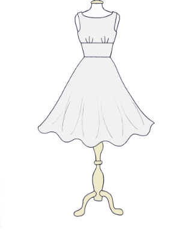

# llm-hackathon-2023

An entry for online LLM hackathon hosted by voiceflow

## Description

The llm-hackathon-2023 project uses a combination of technologies to achieve its goal. It leverages the [Dig for Victory Clothing](https://www.digforvictoryclothing.com/design/your/own/dress) constructor to generate a dress sketch. A Node.js script then uses Puppeteer, a mock browser, to click appropriate options on the site and take a screenshot of the result. However, before generating a dress sketch, the project needs to convert a dress description into the most appropriate constructor options. To achieve this, a JSON file with constructor options has been created. A prompt is then constructed using ChatGPT that has those options. The prompt is designed to select the most appropriate dress options based on the dress description and the JSON file.

Once the prompt is generated, Chat GPT provides a JSON that is validated before it is used by the Node.js script. This validation is done to prevent prompt injections. The Node.js script generates a sketch, as shown below:

**PROMT**

```
A modern dress for a night club
```



Finally, the Stable Diffusion 2 model is used to convert the sketch to a nice-looking dress design. The imaginAIry, a CLI wrapper over SD2, is used to facilitate this process.


## Usage

1. Install _nodejs_ and _python_
2. Install _nodejs_ dependencies

```bash
npm install .
```

3. Install python dependencies

```bash
pip install openai
pip install pil
pip install imaginairy
```

4. Get an OpenAI API key and set it as env variable

```bash
export OPENAI_KEY=sk-**********
```

5. Run a script to convert your dress design to an image

```bash
python scripts/promt_to_params.py --description "A modern dress for a night club"
```

6. Your dress designs are in `./output/generated` folder
